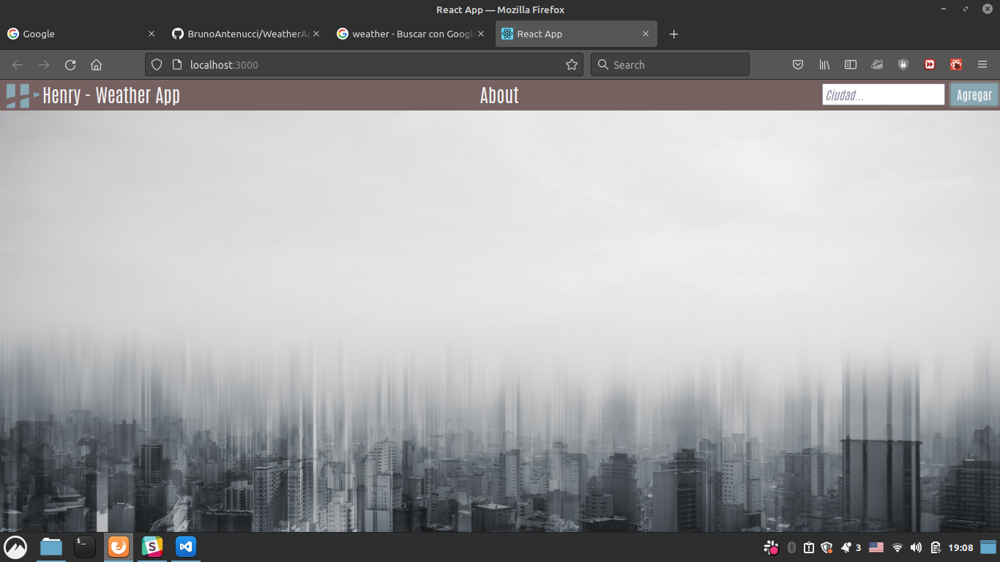
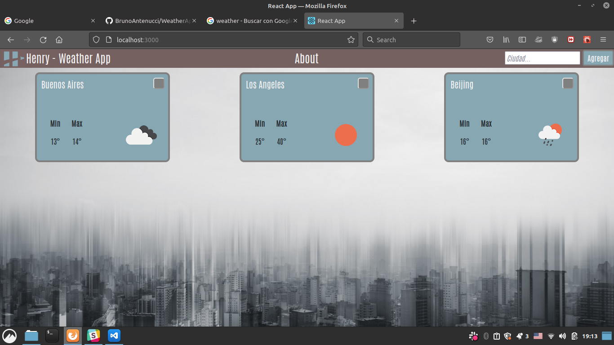
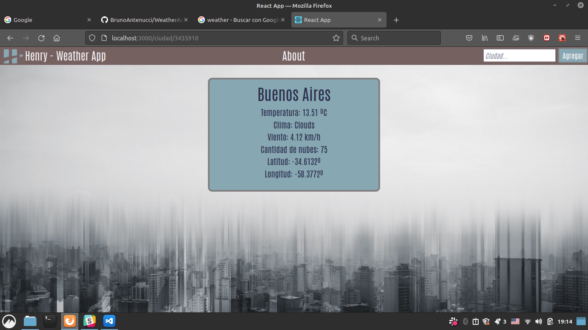

## WeatherApp

This was the first front end project I completed using React, HTML and CSS. It takes weather data from an API and shows it. You can search for several cities and then get the detail for the one you are interested in.

Here are some images:

 

 

